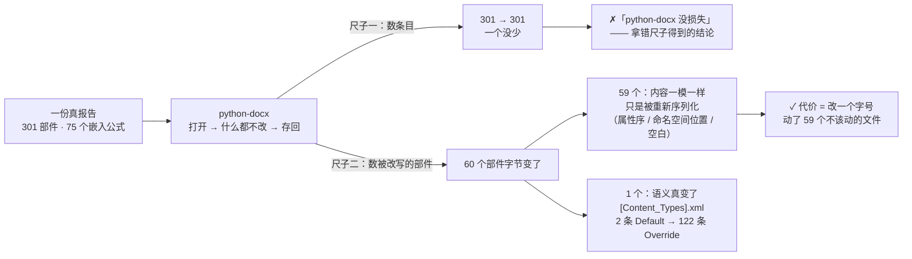
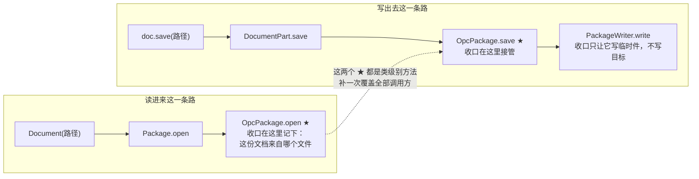
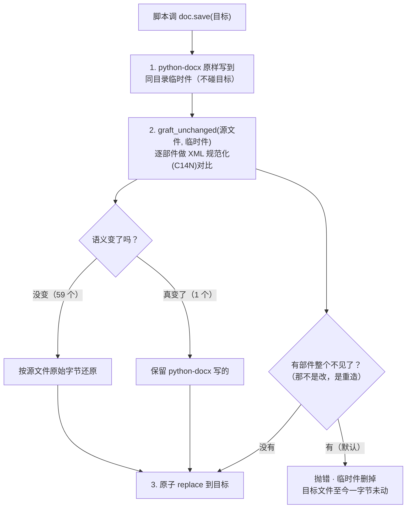

# 用 XML 方式替掉 python-docx · 收口 · 2026-07-30 结案

一句话：**不是把 8500 行改写成手写 XML，而是在 python-docx 唯一的存盘出口上加一道收口，
让它的产物和 surgical 等价。** 60 个部件的炸开面变成 1 个，35 + 25 个脚本的业务逻辑一行没改。

---

## 一 · 先说尺子拿错了

最初我用「zip 条目数」判 python-docx 安不安全，得到的结论是「安全」——**那是错的**。

| 量什么 | python-docx 打开一份 301 部件的报告，什么都不改，直接存回 |
|---|---|
| zip 条目数 | 301 → 301，**一个没少** |
| 字节变了的部件 | **60 个**（`[Content_Types].xml` / `_rels/.rels` / 28 个 header / 14 个 footer …） |
| 语义真变了的部件 | **1 个**（`[Content_Types].xml`：两条 `<Default>` 被拆成 122 条逐文件 `<Override>`） |

59/60 纯属被重新序列化：内容一模一样，只是属性序、命名空间声明位置、空白被改写了一遍。
**条目数相同 ≠ 没损失**。真该问的是「改一个字号，到底碰了多少个不该碰的文件」——60 个，
每一个都是一次「Word 可能渲染得不一样」的机会。

灾难性的那一档另算：`Document()` 新建再搬段落 → 301 条目掉到 17、75 个嵌入公式归零。
16 个脚本里只有 1 个是这种（`pdf_to_docx.py`，它本来就在从 PDF 造新文件）。

（`60 = 59 + 1` —— 关键在于 1 是**包含在** 60 里面的：真正需要被重写的只有那 1 个。）

---

## 二 · 收口点：存盘只有一条路

`inspect.getsource` 实测（不是凭记忆）：

两个 ★ 都是**类级别**方法，所以补在这里有三个好处：① 一处覆盖全部调用方
② **不受 import 顺序影响**（脚本顶部先 `from docx import Document` 也照样生效，实例共享类）
③ docxcompose 之类第三方封装同样落进这条路。

`lib/docx_safe_save.py` = 这道收口。脚本侧只加一行 `import docx_safe_save`。

---

## 三 · 存盘时做的三步（顺序是刻意的）

**graft 在 replace 之前**，所以判定「丢了部件」时目标文件还是原样。先写坏再报错等于没有安全网。

`Document()` 新建文档（源是 python-docx 自带模板）**自动不介入** —— 没有「原件」可保留，
所以 `pdf_to_docx.py` / `df_to_docx.py` 这类从零造文件的脚本加了也不碍事。

不肯静默补回丢失部件的理由写在 `graft_unchanged` 的 docstring 里：补回来的部件没有任何东西
引用它，得到的是一份「看起来完整、其实公式已经不在正文里」的文件，比直接报错危险得多。

---

## 四 · 实测结果

真夹具：`~/Work/projects/supply-net/lishui-缙云/.../统稿12.8-缙云参考.docx`（301 部件 / 75 嵌入 / 154 媒体 / 50 页眉页脚）。

| 场景 | 炸开面（意外改写的部件数） |
|---|---|
| 什么都不改，打开即存回 | 60 → **0**，输出与原件**逐字节相同** |
| 改一个字体（normalize_fonts） | 59 → **1** |
| freeze_heading_numbers | 59 → 1 |
| strip_revisions | 59 → 2 |
| add_header_footer（给 17 个节加页眉页脚） | 59 → 26；老新都新增同样 10 个部件 |
| 另 9 个（set_table_*, strip_*, renumber_*, delete_table_rows, md_merge, number_captions, convert_chapter_format, docx_apply_image_caption） | 59 → **0** |

`[Content_Types].xml` 与原件逐字节一致（python-docx 会删掉的 `<Default Extension="bin">` 保住了）·
zip CRC 干净 · python-docx 可重开（1254 段落 / 57 表 / 17 节）· 改动真的落盘 · 测试套件 74 passed。

**未验的**（如实记，不算通过）：`delete_chapter`（本夹具 H1 无编号，脚本按编号定位）·
`docx_tools` / `fix_heading_disorder` / `reorder_heading_blocks` / `fix_styleset` / `sub/styles.py`
（需要特定调用上下文，HEAD 版报同样的错，**不是这次引入的**）· 8 个在本夹具上什么都没改的 ·
`pdf_to_docx`（要 PDF 输入）。

---

## 五 · 铺到哪些地方

| 位置 | 数量 | 说明 |
|---|---|---|
| doctools 生产脚本 | 35 | 全部收口，有守卫盯 |
| 总部引擎（`~/Dev/tools/dev/lib`） | 3 | `df_to_docx` / `huiwu_generate` / `work_ops` |
| ~/Dev 其余（content / stations） | 3 | |
| ~/Work 交付线（bids / water-src / reclaim / admin） | 18 | 6 个 repo |
| **合计** | **59 个脚本 · 11 个 repo** | 全部 push，ahead=0 |

**故意不收的四类**（各有理由）：`spikes/` `_scratch-*` `09-归档/`（抛弃式一次性件）·
`_backup-pre-shim-*`（蒸馏前冻结备份，本来就该保持当时行为）· `~/Apps/oss/doc-tools-oss`
（**公开脱敏变体，加总部绝对路径会直接破坏对外分发**）· `jobs/` `.venv` `.app/`（临时件/依赖/打包副本）。

---

## 六 · 机器层（不靠记性）

| 闸门 | 干什么 | 反向验证 |
|---|---|---|
| `tools/check_docx_collar.py` | 枚举全仓，用 python-docx 存盘却没挂收口 → 判红 | 3 向：拆掉收口→1 · 无 scripts/→2 · 有目录无脚本→2 |
| `tools/blast_radius.py run` | 量任一条命令的炸开面 | 空命令→2 · 夹具不存在→2 |
| `tools/blast_radius.py diff` | 迁移前后对拍：语义等价 + 炸开面收窄 | 6 向（行为不同→1 · 丢部件→1 · 啥都没改→3 · 正路→0 …） |
| `hooks/docx-surgical-advisory.sh`（cc-home） | 命令里用 python-docx 存盘**且没挂收口** → 喊一声（不阻断） | 9/9 |
| `lib/hooks/pre-commit-python-docx-guard.sh`（tools/dev） | commit 时拦裸用；**挂了收口即合规** | 4/4 |

逃生：`DOCX_GRAFT_OFF=1`（退回裸存盘）· `DOCX_GRAFT_QUIET=1`（不打那行 stderr）·
`SURGICAL_OK=1`（advisory 静默）· `with docx_safe_save.allow_part_loss():`（这段允许丢部件）。

---

## 七 · 途中挖出来的两个真问题

**1. 闸门自己拿错了尺子（连出三个假红）**

三个 bug 全是同一个形状：**拿「新实现 vs 我以为的理想值」判，而不是「老 vs 新」比**。

| # | 假红 | 真相 |
|---|---|---|
| ① | 「正文结果不一致，迁移改变了行为」 | 用 sha1 比字节。新实现在正文语义没变时会把原件字节整个还原（那正是收益），C14N 比对两边完全一致 |
| ② | 「没有收窄炸开面」 | 老实现在这份夹具上根本什么都没改，没有东西可收窄。改成 rc=3「没测到」，既不算通过也不算判红 |
| ③ | 「新实现动了部件集合」 | `add_header_footer` 加页眉页脚是本职，老新都新增同样 10 个 |

按铁律 #11 后半（同一片代码第 3 个 bug = 缺一根轴），那根轴已写进文件顶部：
**diff 判的是等价迁移，每条判据必须是老 vs 新的相对比较。再加判据前先问这一句。**

**2. 同一个守卫有两份，被标 SSOT 的那份是死的**

给 `~/Dev/tools/dev/lib/hooks/pre-commit-python-docx-guard.sh` 加「挂了收口即合规」之后，
water-src 的提交照样被拦。原因：全局 `core.hooksPath=~/.git-hooks` 让各仓 `.git/hooks/`
**整个失效**，真正在跑的是 `~/Dev/tools/configs/git-hooks/pre-commit-docx-guard.sh` 那份副本，
而注释里写着「总部统一 hook」的那份从来没被调用过。

两份并存不是多一份保险，是**改了没用**。现在副本只剩一行 `exec`，逻辑只在总部那份里。

---

## 八 · 还剩什么

- **advisory → 阻断（exit 2）**：`docx-surgical-advisory.sh` 现在只喊不拦。要不要改成硬拦
  需要用户点头 —— 它会拦住任何没挂收口的脚本，属破坏性变更。目前的替代防线是 commit 时的
  pre-commit 守卫（已生效）+ doctools 内的 `check_docx_collar.py`。
- `~/Work/CLAUDE.md:34` 的操作模板仍在教 python-docx 的老姿势。
- 同一条约束在 25 处文档里各写了一份（`/govern` 判据说该只留 hook）。
