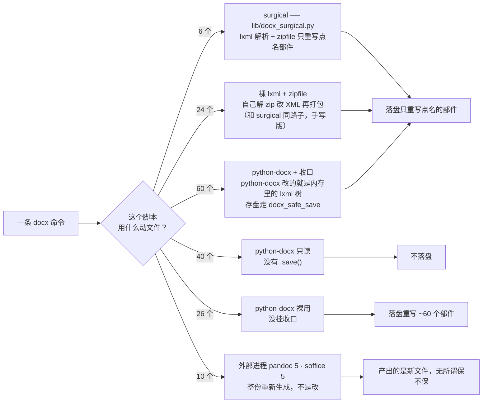
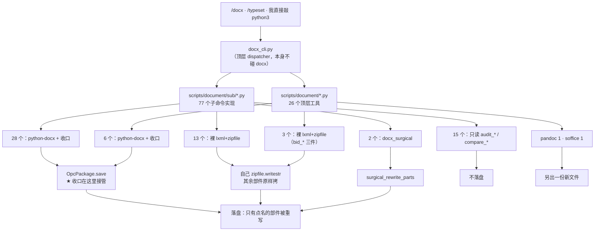

# 所有碰 docx 的脚本 · 底层各是什么 · 2026-07-30

判据全部来自**读源码**（扫 `~/Dev` `~/Work` `~/Apps`，排除 `_archive` `_scratch` `.venv` `.app` 打包副本、jobs 临时件）。
生成器：`~/Dev/tools/doctools/handoffs/_inventory.py`，自己跑一遍就能复现。

**261 个脚本提到 docx，其中 166 个真的动 docx 内部**（另外 95 个只是传路径 / 调 CLI / 判后缀，不碰内容）。

---

## 一 · 底层只有五种，看清哪种会咬人



**那 26 个「裸用」全部是有意豁免的**，一个都不在交付路径上：

| 裸用的 26 个 | 数量 | 为什么不收 |
|---|---:|---|
| doctools 的测试件 | 4 | 有几个测试的断言就是「裸 python-docx 会怎样」，挂上收口反而测不到要测的东西 |
| `~/Work/shared/bids/panan-rigid-2026/scripts/spikes/` | 19 | 2026 年那次标书的一次性抛弃件，跑完就不再用 |
| `~/Apps/oss/doc-tools-oss/backend/` | 3 | **公开脱敏变体**，加 `~/Dev/...` 绝对路径会直接破坏对外分发 |

---

## 二 · 从命令到落盘，中间经过谁



三条路最后是同一个结果 —— **只重写点名的部件**。区别只在写法：surgical 是封装好的，裸 lxml 是各写各的，python-docx 是靠收口补上来的。

---

## 三 · doctools 全量清单

### 3.1 `scripts/document/sub/` —— 77 个子命令实现

**python-docx + 收口（28）** — 改内容的主力

| | | | |
|---|---|---|---|
| add_header_footer | body_replace | combine | convert_chapter_format |
| delete_chapter | delete_empty_h1 | delete_table_rows | fix_heading_disorder |
| fix_styleset | freeze_heading_numbers | md_merge_impl | normalize_fonts |
| number_captions | outline | pair_table_captions | pipeline_lib |
| relocate_orphan_blocks | renumber_headings | renumber_headings_seq | reorder_heading_blocks |
| set_table_align | set_table_borders | split_by_h1 | strip_bookmarks |
| strip_empty_captions | strip_outlinelvl_from_captions | strip_revisions | styles |

**裸 lxml + zipfile（13）** — 本来就是 surgical 路子，只是手写的

| | | | |
|---|---|---|---|
| audit_word_fields | center_images | freeze_all_fields | image_extract |
| line_spacing | md_merge_track | port_sections | relink_images_from_source |
| restyle | strip_doc_protection | strip_orphan_media | strip_style_outlinelvl |
| sync_toc | | | |

**docx_surgical（2）** — `docx_para.py` 及其伙伴，用封装好的 `surgical_rewrite_parts`

**只读，不写盘（15）** — `audit_*` / `compare_*` / `cover_identifier` 这类体检件

**不碰 docx 内部（17）** — 调度、路径、JSON 计划生成

### 3.2 `scripts/document/` —— 26 个顶层工具

| 脚本 | 底层 |
|---|---|
| `docx_apply_image_caption` · `docx_text_formatter` · `docx_tools` · `fix_superscript_refs` · `md_docx_template` · `pdf_to_docx` | python-docx + 收口 |
| `bid_finalize_sweep` · `bid_identity_gate` · `bid_print_ready` | 裸 lxml + zipfile |

> **2026-07-31 注记**：bid_* 家族 6 个入口（`bid_final` / `bid_residue_scan` / `bid_finalize_sweep` / `bid_identity_gate` / `bid_print_ready` / `bid_deref`）已合并为 `bid_gate.py` 子命令族（`run`/`scan`/`sweep`/`identity`/`print`/`deref`），`bid_residue_lib.py` 仍是检测逻辑 SSOT 未动。本节表格保留合并前的历史盘点原貌。
| `docx_apply_template` · `docx_format_clone` · `docx_renumber_figures` · `docx_write_gate` | python-docx 只读 |
| `md_tools` | pandoc |
| `doc_dispatch` | soffice |
| `docx_cli` · `typeset_pipeline` · `bid_final` 等 7 个 | 只调度，不碰内部（`docx_qa` / `review_deep` 2026-07-30 退役） |

> `pdf_to_docx` 是唯一从零造新文件的（`Document()` 无参）。收口对它**自动不介入** —— 没有「原件」可保留。

### 3.3 `lib/` —— 底座

| 文件 | 干什么 |
|---|---|
| `docx_surgical.py` | surgical 本体：`surgical_rewrite_parts` / `graft_unchanged` / `canonical`(C14N) / `verify_repacked` |
| `docx_safe_save.py` | 收口：补 `OpcPackage.open/save`，让 python-docx 的存盘等价于 surgical |
| `docx_xml.py` | 元素级遍历：`iter_text_roots` 覆盖正文/批注/脚注/尾注/页眉页脚（python-docx 的 `.paragraphs` 会漏这些） |

---

## 四 · doctools 之外

| 区块 | 总数 | python-docx+收口 | 裸 lxml+zipfile | 只读 | 裸用 | 外部进程 | 不碰内部 |
|---|---:|---:|---:|---:|---:|---:|---:|
| ~/Work 交付线 | 99 | 19 | 5 + 1 surgical | 14 | 19（全是 panan spikes） | 2 | 39 |
| 总部引擎 `~/Dev/tools/dev` | 22 | 3 | 1 | 2 | 0 | 2 | 14 |
| ~/Dev 其余（content/stations） | 17 | 3 | 2 | 1 | 0 | 1 | 12 |
| ~/Apps | 11 | 0 | 0 | 3 | 3（oss 变体） | 3 | 2 |
| harness `~/.claude` | 2 | 0 | 0 | 0 | 0 | 0 | 2 |

总部那 3 个是 `df_to_docx.py` / `huiwu_generate.py` / `work_ops.py`。

---

## 五 · 自己怎么查

```bash
# 这条命令到底动了几个部件（surgical 的标准就是这个数字）
python3 ~/Dev/tools/doctools/tools/blast_radius.py run 你的.docx -- <任何 docx 命令，{docx} 占位>

# doctools 里有没有漏挂收口的
python3 ~/Dev/tools/doctools/tools/check_docx_collar.py

# 重新生成本清单
python3 ~/Dev/tools/doctools/handoffs/_inventory.py --md
```

逃生开关：`DOCX_GRAFT_OFF=1` 退回裸存盘 · `DOCX_GRAFT_QUIET=1` 不打 stderr 那行。
