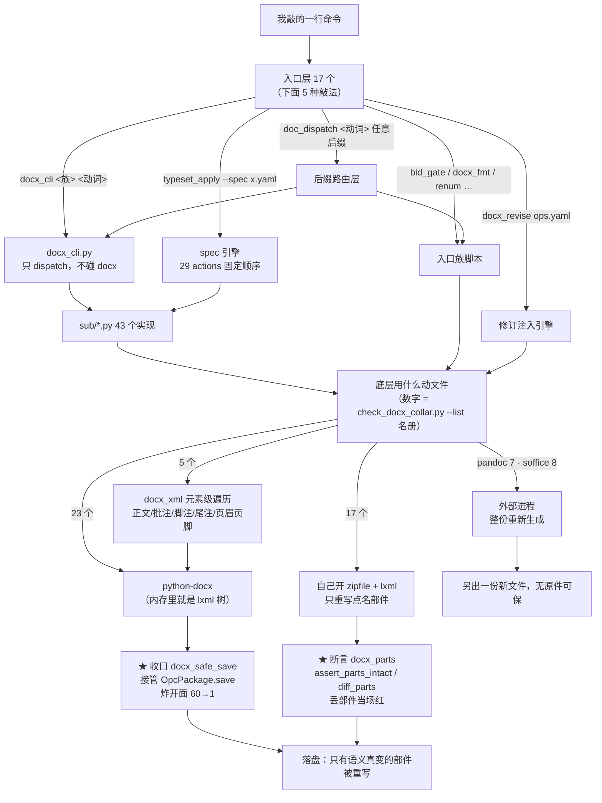

# doctools 现状盘点 · 有几个脚本 · docx 怎么被改 · 2026-08-01

> 上一版（2026-07-30）盘的是**折叠前**的 133 件、且生成器判据有一处误判（见文末「判据修正」）。
> 本版数字全部来自本日实跑的命令，每节都标了取数命令，自己跑一遍就能复现。

## 零 · 一句话

**92 个脚本**（`script_graph.py`：92 个 · 316 条引用 · 0 个孤儿），
其中真正会动 docx 内部的 **55 个**；
它们改 docx 只有 **4 条路**，落盘只有 **2 个收口**，全部由 2 道闸门 fail-closed 守着。

---

## 一 · 92 个脚本分在哪

```bash
python3 tools/script_graph.py --open        # 92 个脚本 · 316 条引用 · 0 个没人引用
```

| 层 | 数量 | 是什么 |
|---|---:|---|
| `scripts/document/` | 17 | **入口层** —— 我实际敲的命令（下节逐个列） |
| `scripts/document/sub/` | 43 | `docx_cli` 的子命令实现（12 个族文件 + 业务模块 + 3 个基建件） |
| `scripts/data/` | 5 | xlsx / 格式互转 |
| `lib/` | 14 | 底座（收口 / 断言 / 元素级遍历 / LLM / 样式） |
| `tools/` | 5 | 闸门与量尺（surface / probe / collar / blast_radius / script_graph） |
| `tests/` | 8 | 回归门 |
| **合计** | **92** | |

`sub/` 那 43 个**不是 43 个命令**：12 个族文件各自装 2–7 个动词（strip×7 / audit×6 / table×4 …），
所以 `docx_cli` 对外仍然是 45 个顶层族 · **125 条子命令**（`tools/cli_surface.py` 的 `subcommands` 字段）。

---

## 二 · 入口层 17 个：我实际敲什么

| 脚本 | 行 | 干什么 | 子命令 |
|---|---:|---|---|
| `docx_cli.py` | 430 | **docx 总入口**，本身不碰 docx，只 dispatch 到 `sub/` | 45 族 / 125 条 |
| `docx_tools.py` | 372 | extract / check / track 的组合入口（batch 并行 + library re-export） | 3 |
| `typeset_apply.py` | 1071 | **spec(yaml) 驱动的排版引擎** —— 一份 yaml 定死整篇版式 | 29 actions |
| `typeset_pipeline.py` | 174 | `/typeset all` 的一条龙 driver（每步 snapshot→自检→保留/回滚） | — |
| `docx_revise.py` | 65 | **修订注入 CLI**：意见 = ops.yaml 数据 → `w:ins/w:del` + 批注（引擎在 `lib/`） | — |
| `bid_gate.py` | 1388 | 标书终稿门检族 | 6（run/scan/sweep/identity/print/deref） |
| `bid_residue_lib.py` | 404 | 残留检测逻辑 SSOT（被上面那个 import，不单敲） | — |
| `docx_fmt.py` | 1540 | 版式 / 字体 / 文本规范化族 | 4（template/clone/fonts/text） |
| `renum.py` | 856 | 编号 / 题注位移与重排族 | 3（chapter/tabfig/figures） |
| `md_tools.py` | 1911 | Markdown 工具集（含 `md2docx` 样式复刻转换） | 8 |
| `pptx_cli.py` | 1508 | PPTX 族（双解释器契约：系统 python3 / venv 各管一半） | 13 |
| `pdf_cli.py` | 1971 | PDF 族（read/convert/pipeline/图表抽取…） | 14 |
| `md_to_audiobook.py` | 1142 | md → 有声书（edge-tts，章节并发；PEP-723 依赖隔离） | — |
| `chart.py` | 890 | 数据驱动图表（JSON → PNG） | 4（bar/gantt/flow/insert） |
| `doc_dispatch.py` | 624 | **按后缀路由**的统一调度器（命令只表达动词，格式运行时认） | 14 |
| `doc_gui_backend.py` | 544 | 给 `doc_dispatch` 套 JSON 信封，供 SwiftUI app 调用 | — |
| `docx_write_gate.py` | 65 | 原地写回**并发门**：写回前 md5/mtime 基线比对（多会话/WPS 同改一份 docx 是常态） | — |

取数：`wc -l scripts/document/*.py` · 各脚本 `--help`。

---

## 三 · docx 的操作路径：从我敲的那行到落盘



**四条路，两个收口，一个结果**：不管走哪条，落盘时**只有语义真变了的部件被重写**。

| 路 | 谁在用 | 为什么需要它 |
|---|---:|---|
| python-docx + `docx_safe_save` 收口 | 23 | python-docx 什么都不改地开→存，也会重写 ~60 个部件（301 部件真报告实测：60 个字节变了、只有 1 个语义真变）。收口把语义未变的部件按原字节还原，炸开面 **60→1**；无改动时输出与原件**逐字节相同** |
| 裸 zipfile + lxml（含 `lib/docx_surgical.py` 封装） | 17 | 收口是 monkey-patch python-docx 的存盘，这条路它**一个字节都管不到**。实测两次事故：162 部件→74（11 个原生图表 + 58 个页眉页脚全丢）、137→35，两次文件都照样能打开、Word 不报错 → 必须挂部件完整性断言 |
| `lib/docx_xml.py` 元素级遍历 | 5 | 凡是「把全文某类字符改一遍」的引擎必走。python-docx 的 `.paragraphs` 只认 `w:body/./w:p`、`.runs` 只认 `./w:r`，**静默漏掉**修订态（`w:ins`/`w:del`）、超链接、文本框、嵌套表；批注/脚注/尾注整个 part 碰不到 |
| 外部进程 pandoc / soffice / docxcompose | 7 / 8 / 3 | 产出的是新文件，不是改原件，不涉收口 |

> 删除态（`w:del`/`w:moveFrom`）的文本载体是 `w:delText`，写成 `w:t` = 把删掉的字变回正文。
> `set_run_text` / `text_tag_for` 已挡住这条，回归门 `tests/test_docx_text_formatter_scopes.py`（老实现在此测试下 9 红）。

---

## 四 · 守着这四条路的闸门（全部 fail-closed）

```bash
python3 tools/check_docx_collar.py      # 两条判据：收口 23/23 · 部件断言 17/17
python3 tools/cli_surface.py            # CLI 接口指纹（125 子命令 + dest/required/metavar）
python3 tools/cli_forward_probe.py      # 67 条内嵌预期 argv 比对：真正转发出去的是什么
python3 -m pytest scripts/document/tests scripts/document/sub/tests -q   # 82 passed
python3 tools/script_graph.py           # 92 脚本 · 316 引用 · 0 孤儿
python3 tools/blast_radius.py run <docx> -- <命令，{docx} 占位>          # 量某条命令的炸开面
```

**`cli_surface` 单跑不够**：它证明接口没变，证明不了参数传过去还是原样 ——「命令能敲、
跑出来的东西不对」这一类它完全看不见。`cli_forward_probe` 2026-07-31 从「录音机」重建成
**比对器**（67 条预期 argv 内嵌在脚本里），改错转发当场转红（已反向验证）。

逃生开关：`DOCX_GRAFT_OFF=1` 退回裸存盘 · `DOCX_GRAFT_QUIET=1` 不打 stderr 那行。

---

## 五 · 折叠前后（2026-07-31 一天做完 P1–P12）

| | 折叠前 | 现在 | 变化 |
|---|---:|---:|---|
| 仓内脚本总数 | 133 | **92** | −41 |
| `scripts/document/` 入口散件 | 26 | **17** | 9 个入口族 → 2 个（`renum` / `docx_fmt`）+ 1 个平移进 `sub/` |
| `scripts/document/sub/` | 72 | **43** | 42 个旧件 → 12 个子命令族文件 |
| docx_cli 对外子命令 | 125 | **125** | **一条没少** |
| CLI 接口指纹 | — | — | surface diff **逐字节空** |

具体到族：bid 6→1 · pdf 3→1 · pptx 4→1 · md 3→2 · 编号题注 3→1 · 版式字体 4→1 ·
sub/ 12 族 42→12。**没有砍功能**，砍的是「同一件事分居 N 个文件」和真重复代码
（pdf 族去重 3 处：pdfimages 包装 ×3 / 3072 阈值 / sanitize 共底）。

验收方式全部同一套：真件 stdout/exit **逐字节对拍** + 产物**逐部件 sha256** + 上面 5 道闸门。
逐条销项账见 `handoffs/docx-refactor-roadmap.md` §五 P1–P12。

---

## 六 · doctools 之外：全生态 docx 脚本

```bash
python3 handoffs/_inventory.py --md     # 扫 ~/Dev ~/Work ~/Apps，判据来自读源码
```

**250 个脚本提到 docx，163 个真的动 docx 内部**（另外 87 个只传路径 / 调 CLI / 判后缀）。

| 底层引擎 | 个数 |
|---|---:|
| python-docx + 收口 | 50 |
| python-docx（只读，不写盘） | 28 |
| python-docx（**裸，没收口**） | 27 |
| 裸 lxml + zipfile | 23 |
| surgical（`docx_surgical`） | 16 |
| soffice / pandoc（外部进程） | 8 / 7 |
| `docx_xml` 元素级遍历 | 4 |

那 **27 个裸用一个都不在交付路径上**，全部是有意豁免：

| 裸用的 27 个 | 数量 | 为什么不收 |
|---|---:|---|
| doctools 测试件 | 5 | 有几个测试的断言就是「裸 python-docx 会怎样」，挂上收口反而测不到要测的东西 |
| `~/Work/shared/bids/panan-rigid-2026/scripts/spikes/` | 19 | 那次标书的一次性抛弃件，跑完不再用 |
| `~/Apps/oss/doc-tools-oss/backend/` | 3 | **公开脱敏变体**，加 `~/Dev/…` 绝对路径会直接破坏对外分发 |

### 判据修正（2026-08-01）

`_inventory.py` 原来把 python-docx 的判据写成 `from docx[\w.]*\s+import`，于是
**`from docx_parts import assert_parts_intact` 被判成「裸用 python-docx 写盘」** ——
`pptx_cli.py`（用的是 python-**pptx**，一行 python-docx 都没有）被误列进裸用名册。
`check_docx_collar.py` 2026-07-31 修过同一条正则，这份没跟上。

已改成**从守卫本体 import 那两条正则**，判据不再分居两处（上一版 md 里的「26 个裸用」
和引擎分布因此都偏了一格）。修复后重跑：名册减掉的正好只有 `pptx_cli.py` 一个。
